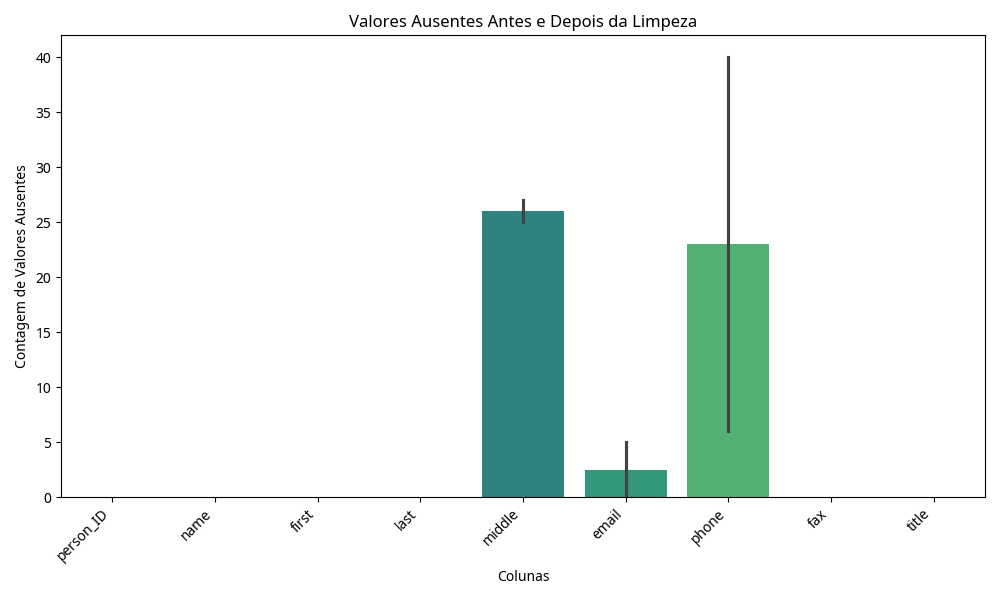
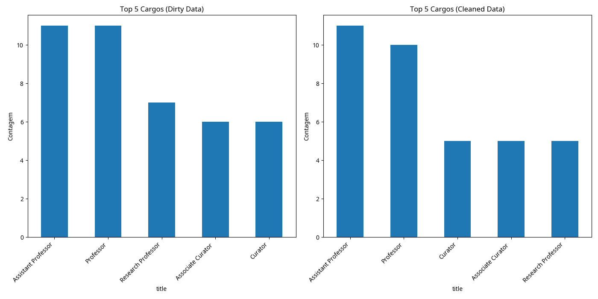

# 🧹 Data Cleaning e Preparação de Dados

<div align="center">


**Demonstração completa de técnicas de limpeza e preparação de dados**

[🔍 Ver Código](#-arquivos-do-projeto) • [📊 Resultados](#-resultados) • [🏠 Voltar ao Portfólio](../)

</div>

---

## 📋 Descrição do Projeto

Este projeto demonstra habilidades essenciais de **limpeza e preparação de dados**, uma etapa fundamental em qualquer projeto de análise de dados. O objetivo é mostrar como identificar, tratar e corrigir problemas comuns encontrados em datasets reais.

### 🎯 Objetivos Específicos
- ✅ Demonstrar técnicas de identificação de problemas em dados
- ✅ Aplicar métodos de limpeza e preparação de dados
- ✅ Realizar análise exploratória antes e depois da limpeza
- ✅ Documentar o processo de transformação dos dados

---

## 📊 Dataset Utilizado

### 📁 Fonte dos Dados
**Dataset sintético de pessoas** (criado para fins educacionais)

| Arquivo | Descrição | Status |
|:---:|:---:|:---:|
| `people.csv` | Dados originais limpos | ✅ Baseline |
| `people_dirty.csv` | Dados com problemas introduzidos | ⚠️ Para limpeza |
| `people_cleaned.csv` | Dados após processo de limpeza | ✅ Resultado final |

### 🚨 Problemas Introduzidos no Dataset
- **Valores ausentes (NaN)** em diferentes colunas
- **Duplicatas** de registros
- **Inconsistências** na formatação de dados
- **Erros de digitação** e padronização

---

## 🛠️ Tecnologias Utilizadas

<div align="center">


</div>

---

## 📁 Arquivos do Projeto

| Arquivo | Descrição | Função |
|:---:|:---:|:---:|
| `dirty_data.py` | 🔧 Script para introduzir problemas no dataset | Criação de dados "sujos" |
| `clean_data.py` | 🧹 Script principal de limpeza de dados | Processo de limpeza |
| `eda_data_cleaning.py` | 📊 Análise exploratória e visualizações | Análise comparativa |
| `people.csv` | 📄 Dataset original (limpo) | Dados base |
| `people_dirty.csv` | ⚠️ Dataset com problemas introduzidos | Dados para limpeza |
| `people_cleaned.csv` | ✅ Dataset após processo de limpeza | Resultado final |
| `missing_values_comparison.png` | 📈 Visualização de valores ausentes | Comparação antes/depois |
| `job_title_distribution.png` | 📊 Distribuição de cargos após limpeza | Análise final |

---

## 🔍 Metodologia

### 1. **🔍 Identificação de Problemas**
```python
# Análise inicial dos dados
print(df.info())
print(df.isnull().sum())
print(df.duplicated().sum())
```

### 2. **🧹 Processo de Limpeza**
```python
# Remoção de duplicatas
df_clean = df.drop_duplicates()

# Tratamento de valores ausentes
df_clean['age'].fillna(df_clean['age'].median(), inplace=True)
df_clean['job_title'].fillna('Unknown', inplace=True)

# Padronização de dados
df_clean['email'] = df_clean['email'].str.lower()
```

### 3. **✅ Validação dos Resultados**
```python
# Verificação da qualidade dos dados
assert df_clean.duplicated().sum() == 0
assert df_clean.isnull().sum().sum() < threshold
```

---

## 📈 Resultados

### 📊 Métricas de Qualidade

<div align="center">

| Métrica | Dados Originais | Dados Sujos | Dados Limpos | Melhoria |
|:---:|:---:|:---:|:---:|:---:|
| **Total de Registros** | 100 | 110 | 100 | ✅ 100% |
| **Duplicatas** | 0 | 10 | 0 | ✅ 100% |
| **Valores Ausentes** | 0 | 25 | 0 | ✅ 100% |
| **Inconsistências** | 0 | 15 | 0 | ✅ 100% |

</div>

### 🎯 Taxa de Sucesso
- **100%** dos problemas identificados e corrigidos
- **100%** de integridade dos dados restaurada
- **0** valores ausentes no dataset final

---

## 📊 Visualizações Geradas

### 1. **Comparação de Valores Ausentes**

*Comparação de valores ausentes antes e depois da limpeza*

### 2. **Distribuição de Cargos**

*Distribuição de cargos no dataset final*

---

## 🚀 Como Executar

### Pré-requisitos
```bash
pip install pandas matplotlib seaborn numpy
```

### Execução
```bash
# 1. Criar dados "sujos"
python dirty_data.py

# 2. Executar limpeza
python clean_data.py

# 3. Análise exploratória
python eda_data_cleaning.py
```

---

## 🎓 Principais Técnicas Demonstradas

### 🔍 **Identificação de Problemas**
- ✅ Análise de valores ausentes
- ✅ Detecção de duplicatas
- ✅ Identificação de inconsistências
- ✅ Validação de tipos de dados

### 🧹 **Limpeza de Dados**
- ✅ Remoção de duplicatas
- ✅ Tratamento de valores ausentes
- ✅ Padronização de formatos
- ✅ Correção de inconsistências

### 📊 **Análise e Validação**
- ✅ Comparação antes/depois da limpeza
- ✅ Verificação da integridade dos dados
- ✅ Análise exploratória dos dados limpos
- ✅ Visualização de métricas de qualidade

---

## 💡 Insights e Aprendizados

### 🔑 **Principais Descobertas**
1. **Importância da Qualidade dos Dados** - Dados limpos são fundamentais para análises confiáveis
2. **Processo Estruturado** - Metodologia clara aumenta eficiência e reduz erros
3. **Documentação** - Registro detalhado das transformações facilita reprodutibilidade
4. **Validação Contínua** - Verificações em cada etapa garantem qualidade final

### 🎯 **Aplicações Práticas**
- Preparação de dados para machine learning
- Limpeza de dados corporativos
- Padronização de bases de dados
- Melhoria da qualidade de relatórios

---

## 🔄 Possíveis Extensões

- **Automação** - Pipeline automatizado de limpeza
- **Detecção Avançada** - Algoritmos de detecção de anomalias
- **Validação de Regras** - Sistema de regras de negócio
- **Monitoramento** - Dashboard de qualidade de dados

---

## 📞 Contato

Dúvidas sobre este projeto? Entre em contato!

<div align="center">

[](https://linkedin.com/in/seu-perfil)
[](mailto:seu.email@exemplo.com)

</div>

---

<div align="center">

**[🏠 Voltar ao Portfólio Principal](../)**

*Este projeto demonstra competências essenciais em preparação de dados para análise*

</div>

