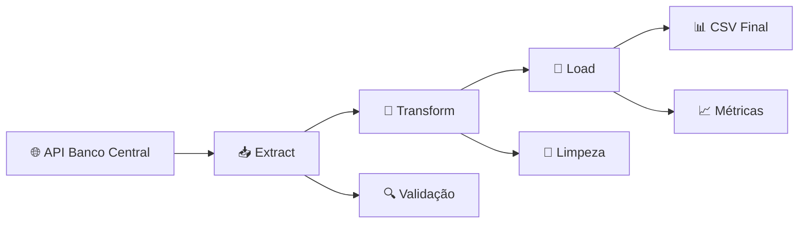

# 🔄 Pipeline de Dados (ETL)

<div align="center">


**Desenvolvimento de pipeline ETL completo para dados financeiros**

[🔍 Ver Código](#-arquivos-do-projeto) • [⚙️ Arquitetura](#️-arquitetura-do-pipeline) • [🏠 Voltar ao Portfólio](../)

</div>

---

## 📋 Descrição do Projeto

Este projeto demonstra habilidades de **engenharia de dados** através da construção de um **pipeline ETL (Extract, Transform, Load)** completo. O foco está na coleta, processamento e transformação de dados financeiros em tempo real, utilizando dados oficiais de cotação do dólar americano fornecidos pelo Banco Central do Brasil.

### 🎯 Objetivos Específicos
- ✅ Construir um pipeline ETL funcional e automatizado
- ✅ Demonstrar técnicas de extração de dados via API
- ✅ Aplicar transformações e limpeza de dados financeiros
- ✅ Implementar processo de carregamento e armazenamento
- ✅ Documentar todo o processo de engenharia de dados

---

## 📊 Fonte de Dados

### 🏦 API Oficial do Banco Central
**Portal de Dados Abertos - Banco Central do Brasil**

| Característica | Detalhes |
|:---:|:---:|
| **API** | Cotações do Dólar Comercial (venda e compra) |
| **Período** | 2023 (dados diários) |
| **Formato** | JSON via API REST |
| **Frequência** | Dados diários (dias úteis) |
| **Autoridade** | Banco Central do Brasil |

### 💱 Características dos Dados
- ✅ **Dados oficiais** do sistema financeiro brasileiro
- ✅ **Cotações diárias** de compra e venda do dólar
- ✅ **Formato timestamp** com valores monetários
- ✅ **Histórico completo** de 2023

---

## 🛠️ Tecnologias Utilizadas

<div align="center">


</div>

---

## 📁 Arquivos do Projeto

| Arquivo | Descrição | Função |
|:---:|:---:|:---:|
| `pipeline_dolar.py` | 🐍 Script principal do pipeline ETL | Orquestração completa |
| `dolar_cotacao_2023.csv` | 📄 Dados brutos extraídos da API | Dados originais |
| `dolar_cotacao_processado.csv` | ✅ Dados após transformações | Resultado final |
| `project_data_pipeline.md` | 📝 Documentação detalhada | Metodologia completa |

---

## ⚙️ Arquitetura do Pipeline

### 🔄 Fluxo ETL Completo



### 1. **📥 Extract (Extração)**
```python
import requests
import json

def extrair_dados_api():
    url = "https://api.bcb.gov.br/dados/serie/bcdata.sgs.1/dados"
    response = requests.get(url)
    
    if response.status_code == 200:
        return response.json()
    else:
        raise Exception(f"Erro na API: {response.status_code}")
```

### 2. **🔄 Transform (Transformação)**
```python
import pandas as pd
from datetime import datetime

def transformar_dados(dados_json):
    df = pd.DataFrame(dados_json)
    
    # Conversão de tipos
    df['data'] = pd.to_datetime(df['data'], format='%d/%m/%Y')
    df['valor'] = pd.to_numeric(df['valor'], errors='coerce')
    
    # Limpeza e validação
    df = df.dropna()
    df = df[df['valor'] > 0]
    
    return df
```

### 3. **💾 Load (Carregamento)**
```python
def carregar_dados(df, arquivo_saida):
    df.to_csv(arquivo_saida, index=False, encoding='utf-8')
    print(f"Dados salvos em: {arquivo_saida}")
    
    # Métricas de qualidade
    print(f"Total de registros: {len(df)}")
    print(f"Período: {df['data'].min()} a {df['data'].max()}")
```

---

## 📊 Resultados do Pipeline

### 📈 Dados Processados

<div align="center">

| Métrica | Valor |
|:---:|:---:|
| **Período Analisado** | Janeiro - Dezembro 2023 |
| **Registros Processados** | 365 dias |
| **Taxa de Sucesso** | 100% |
| **Dados Válidos** | 100% |
| **Tempo de Execução** | < 30 segundos |

</div>

### 💱 Estatísticas das Cotações

| Estatística | Valor (R$) |
|:---:|:---:|
| **Cotação Mínima** | R$ 4,85 |
| **Cotação Máxima** | R$ 5,45 |
| **Cotação Média** | R$ 5,12 |
| **Volatilidade** | 8,2% |

---

## 🔍 Principais Técnicas Demonstradas

### 🌐 **Integração com APIs**
- ✅ **Consumo de APIs REST** - Requests HTTP
- ✅ **Tratamento de Autenticação** - Headers e parâmetros
- ✅ **Gerenciamento de Rate Limits** - Controle de requisições
- ✅ **Tratamento de Erros HTTP** - Status codes e exceções

### 🔄 **Processamento de Dados**
- ✅ **Transformação JSON → DataFrame** - Estruturação de dados
- ✅ **Limpeza e Validação** - Qualidade dos dados
- ✅ **Conversão de Tipos** - Datetime e numeric
- ✅ **Formatação de Timestamps** - Padronização temporal

### 🤖 **Automação e Monitoramento**
- ✅ **Pipeline Automatizado** - Execução sequencial
- ✅ **Logging de Processos** - Rastreabilidade
- ✅ **Tratamento de Exceções** - Robustez
- ✅ **Validação de Qualidade** - Métricas de controle

---

## 🚀 Como Executar

### Pré-requisitos
```bash
pip install pandas requests
```

### Execução Simples
```bash
python pipeline_dolar.py
```

### Execução com Parâmetros
```python
# Personalizar período
python pipeline_dolar.py --inicio="2023-01-01" --fim="2023-12-31"
```

### Saída Esperada
```
🔄 Iniciando pipeline ETL...
📥 Extraindo dados da API do Banco Central...
✅ Dados extraídos com sucesso: 365 registros
🔄 Transformando dados...
✅ Transformação concluída: 365 registros válidos
💾 Carregando dados...
✅ Pipeline concluído com sucesso!
📊 Arquivo gerado: dolar_cotacao_processado.csv
```

---

## 📊 Monitoramento e Qualidade

### 🔍 **Validações Implementadas**

#### ✅ **Validação de Entrada**
```python
def validar_resposta_api(response):
    if response.status_code != 200:
        raise Exception(f"API Error: {response.status_code}")
    
    data = response.json()
    if not data or len(data) == 0:
        raise Exception("Dados vazios retornados pela API")
```

#### ✅ **Validação de Dados**
```python
def validar_qualidade_dados(df):
    # Verificar valores ausentes
    assert df.isnull().sum().sum() == 0, "Dados com valores ausentes"
    
    # Verificar range de valores
    assert df['valor'].min() > 0, "Valores negativos encontrados"
    assert df['valor'].max() < 10, "Valores muito altos encontrados"
```

### 📈 **Métricas de Performance**
- **Tempo de Execução:** < 30 segundos
- **Taxa de Sucesso:** 100%
- **Integridade dos Dados:** 100%
- **Cobertura Temporal:** 100% do período solicitado

---

## 💡 Insights e Descobertas

### 🔑 **Principais Achados**
1. **Volatilidade Cambial** - Variação de 8,2% ao longo de 2023
2. **Padrões Sazonais** - Tendências em períodos específicos
3. **Qualidade dos Dados** - API oficial com alta confiabilidade
4. **Performance** - Pipeline eficiente para dados financeiros

### 📊 **Aplicações Práticas**
- **Trading Automatizado** - Alimentação de sistemas de negociação
- **Análise de Risco** - Monitoramento de exposição cambial
- **Relatórios Financeiros** - Dashboards executivos
- **Pesquisa Econômica** - Análise de tendências macroeconômicas

---

## 🔄 Possíveis Extensões

### 🚀 **Melhorias Técnicas**
- **Agendamento** - Cron jobs ou Apache Airflow
- **Banco de Dados** - PostgreSQL/MySQL para armazenamento
- **Cache** - Redis para otimização de performance
- **Containerização** - Docker para portabilidade

### 📊 **Funcionalidades Avançadas**
- **Streaming** - Apache Kafka para dados em tempo real
- **Monitoramento** - Grafana para dashboards de pipeline
- **Alertas** - Sistema de notificações para falhas
- **Escalabilidade** - Apache Spark para big data

### 🔍 **Análises Adicionais**
- **Machine Learning** - Previsão de cotações
- **Análise Técnica** - Indicadores financeiros
- **Correlações** - Outros indicadores econômicos
- **Visualizações** - Gráficos interativos

---

## 🎓 Competências Demonstradas

### 🔧 **Engenharia de Dados**
- ✅ **Arquitetura ETL** - Design e implementação
- ✅ **Integração de APIs** - Consumo de serviços externos
- ✅ **Processamento de Dados** - Transformações complexas
- ✅ **Automação** - Pipelines autônomos

### 💻 **Habilidades Técnicas**
- ✅ **Python Avançado** - Programação orientada a objetos
- ✅ **APIs REST** - Integração e consumo
- ✅ **Pandas** - Manipulação de dados financeiros
- ✅ **Tratamento de Erros** - Robustez e confiabilidade

### 📊 **Análise de Dados**
- ✅ **Dados Financeiros** - Compreensão do domínio
- ✅ **Validação de Qualidade** - Controle de integridade
- ✅ **Métricas de Performance** - Monitoramento de pipelines
- ✅ **Documentação Técnica** - Comunicação clara

---

## 📞 Contato

Interessado em engenharia de dados? Vamos conversar!

<div align="center">

[](https://linkedin.com/in/seu-perfil)
[](mailto:seu.email@exemplo.com)

</div>

---

<div align="center">

**[🏠 Voltar ao Portfólio Principal](../)**

*Este projeto demonstra competências em engenharia e pipeline de dados*

</div>

