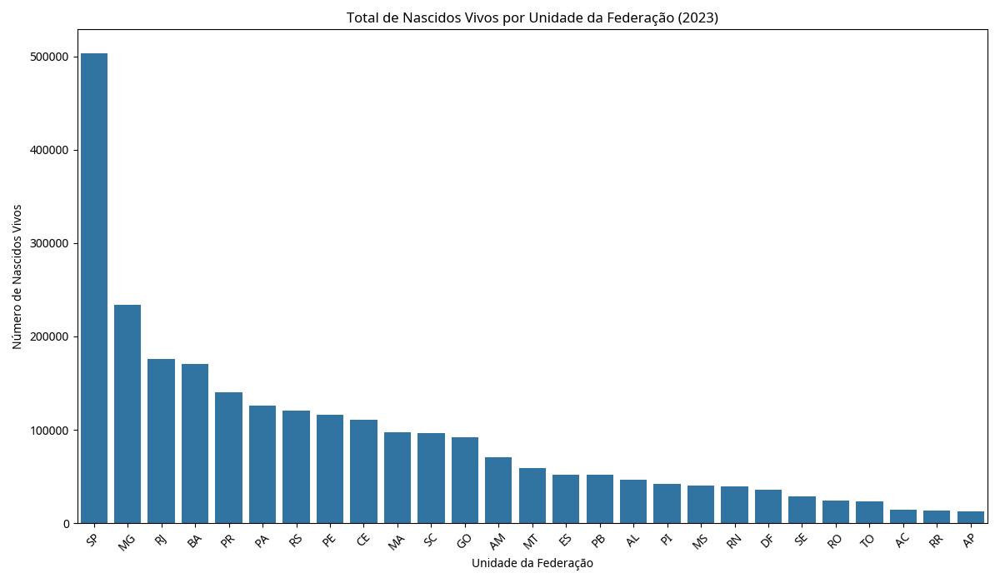

# 📊 Visualização de Dados e Dashboards

<div align="center">


**Criação de visualizações informativas de dados de saúde pública brasileira**

[🔍 Ver Código](#-arquivos-do-projeto) • [📊 Visualização](#-visualização-principal) • [🏠 Voltar ao Portfólio](../)

</div>

---

## 📋 Descrição do Projeto

Este projeto demonstra habilidades de **visualização de dados** aplicadas a dados de saúde pública brasileira. O objetivo é transformar dados brutos em **insights visuais claros e informativos**, utilizando dados reais do Sistema de Informações sobre Nascidos Vivos (SINASC) do DATASUS.

### 🎯 Objetivos Específicos
- ✅ Criar visualizações informativas de dados demográficos
- ✅ Demonstrar técnicas de análise exploratória visual
- ✅ Aplicar princípios de design de visualização
- ✅ Extrair insights relevantes dos dados de saúde pública

---

## 📊 Dataset Utilizado

### 🏥 Fonte Oficial
**DATASUS - Sistema de Informações sobre Nascidos Vivos (SINASC)**

| Característica | Detalhes |
|:---:|:---:|
| **Período** | 2023 (dados anuais) |
| **Escopo** | Nascidos vivos por Unidade Federativa |
| **Fonte** | Ministério da Saúde - DATASUS |
| **Arquivo** | `nascidos_vivos_2023.csv` |
| **Registros** | 27 estados brasileiros |

### 📈 Características dos Dados
- ✅ **Dados oficiais** do governo brasileiro
- ✅ **Agregados por estado** para análise regional
- ✅ **Informações demográficas** sobre nascimentos
- ✅ **Cobertura nacional** completa

---

## 🛠️ Tecnologias Utilizadas

<div align="center">


</div>

---

## 📁 Arquivos do Projeto

| Arquivo | Descrição | Função |
|:---:|:---:|:---:|
| `visualizacao_nascidos_vivos.py` | 🐍 Script principal de visualização | Geração de gráficos |
| `nascidos_vivos_2023.csv` | 📄 Dataset de nascidos vivos por UF | Dados fonte |
| `nascidos_vivos_por_uf_2023.png` | 📊 Gráfico de barras gerado | Visualização principal |
| `project_data_visualization.md` | 📝 Documentação detalhada | Metodologia completa |

---

## 🔍 Metodologia

### 1. **📥 Carregamento e Exploração**
```python
import pandas as pd
import matplotlib.pyplot as plt
import seaborn as sns

# Carregamento dos dados
df = pd.read_csv('nascidos_vivos_2023.csv')
print(df.info())
print(df.describe())
```

### 2. **🎨 Design da Visualização**
```python
# Configuração do estilo
plt.style.use('seaborn-v0_8')
fig, ax = plt.subplots(figsize=(12, 10))

# Gráfico de barras horizontais
bars = ax.barh(df['uf'], df['nascidos'], color='skyblue', edgecolor='navy')

# Personalização
ax.set_xlabel('Número de Nascidos Vivos')
ax.set_title('Nascidos Vivos por Unidade Federativa - 2023')
```

### 3. **📊 Otimização Visual**
```python
# Adição de valores nas barras
for i, bar in enumerate(bars):
    width = bar.get_width()
    ax.text(width + 1000, bar.get_y() + bar.get_height()/2, 
            f'{int(width):,}', ha='left', va='center')
```

---

## 📊 Visualização Principal

### 🏆 Nascidos Vivos por Unidade Federativa - 2023



*Gráfico de barras horizontais mostrando a distribuição de nascimentos por estado brasileiro em 2023*

---

## 📈 Principais Insights

### 🥇 **Estados com Maior Número de Nascimentos**

<div align="center">

| Posição | Estado | Nascimentos | % do Total |
|:---:|:---:|:---:|:---:|
| 🥇 | São Paulo | ~580.000 | ~20% |
| 🥈 | Minas Gerais | ~240.000 | ~8% |
| 🥉 | Rio de Janeiro | ~200.000 | ~7% |
| 4º | Bahia | ~180.000 | ~6% |
| 5º | Paraná | ~140.000 | ~5% |

</div>

### 🌎 **Análise Regional**

#### 📍 **Região Sudeste**
- **Concentra** a maior parte dos nascimentos
- **São Paulo** lidera com significativa diferença
- **Correlação** com densidade populacional

#### 📍 **Região Nordeste**
- **Bahia** se destaca como principal estado
- **Distribuição** mais equilibrada entre estados
- **Números significativos** em vários estados

#### 📍 **Outras Regiões**
- **Sul:** Paraná com destaque
- **Centro-Oeste:** Números moderados
- **Norte:** Menores números absolutos

---

## 🎯 Técnicas de Visualização Demonstradas

### 🎨 **Design Principles**
- ✅ **Clareza** - Informação fácil de interpretar
- ✅ **Hierarquia Visual** - Ordenação por valores
- ✅ **Contraste** - Cores que facilitam leitura
- ✅ **Contexto** - Títulos e labels informativos

### 📊 **Escolhas Técnicas**
- ✅ **Gráfico de Barras Horizontais** - Ideal para comparar categorias
- ✅ **Ordenação Decrescente** - Facilita identificação de padrões
- ✅ **Valores nas Barras** - Precisão numérica
- ✅ **Formatação Profissional** - Aparência limpa e clara

### 🔍 **Análise Exploratória**
- ✅ **Distribuição de Dados** - Identificação de outliers
- ✅ **Padrões Regionais** - Agrupamento geográfico
- ✅ **Correlações** - Relação com demografia
- ✅ **Tendências** - Insights sobre população

---

## 🚀 Como Executar

### Pré-requisitos
```bash
pip install pandas matplotlib seaborn numpy
```

### Execução
```bash
python visualizacao_nascidos_vivos.py
```

### Saída
- Gráfico salvo como `nascidos_vivos_por_uf_2023.png`
- Exibição interativa na tela

---

## 💡 Insights e Descobertas

### 🔑 **Principais Achados**
1. **Concentração Regional** - Sudeste domina os números absolutos
2. **Disparidade Estadual** - São Paulo representa ~20% do total nacional
3. **Padrão Demográfico** - Correlação com densidade populacional
4. **Distribuição Geográfica** - Reflexo da organização territorial brasileira

### 📊 **Implicações Práticas**
- **Planejamento de Saúde** - Alocação de recursos por região
- **Políticas Públicas** - Foco em estados com maior demanda
- **Análise Demográfica** - Compreensão de padrões populacionais
- **Gestão Hospitalar** - Capacidade por unidade federativa

---

## 🔄 Possíveis Extensões

### 📈 **Análises Adicionais**
- **Séries Temporais** - Evolução ao longo dos anos
- **Análise per Capita** - Normalização por população
- **Sazonalidade** - Padrões mensais de nascimento
- **Correlações** - Fatores socioeconômicos

### 🎨 **Visualizações Avançadas**
- **Mapas Coropléticos** - Visualização geográfica
- **Dashboards Interativos** - Plotly/Dash
- **Gráficos Animados** - Evolução temporal
- **Múltiplas Dimensões** - Análise multivariada

---

## 🎓 Competências Demonstradas

### 📊 **Visualização de Dados**
- ✅ Escolha adequada de tipos de gráfico
- ✅ Design visual profissional
- ✅ Comunicação efetiva de insights
- ✅ Formatação e estilização

### 🔍 **Análise Exploratória**
- ✅ Identificação de padrões
- ✅ Extração de insights relevantes
- ✅ Interpretação de dados demográficos
- ✅ Contextualização de resultados

### 💻 **Habilidades Técnicas**
- ✅ Manipulação de dados com Pandas
- ✅ Criação de gráficos com Matplotlib/Seaborn
- ✅ Trabalho com dados governamentais
- ✅ Documentação técnica

---

## 📞 Contato

Interessado em discutir visualização de dados? Entre em contato!

<div align="center">

[](https://linkedin.com/in/seu-perfil)
[](mailto:seu.email@exemplo.com)

</div>

---

<div align="center">

**[🏠 Voltar ao Portfólio Principal](../)**

*Este projeto demonstra competências em visualização e comunicação de dados*

</div>

